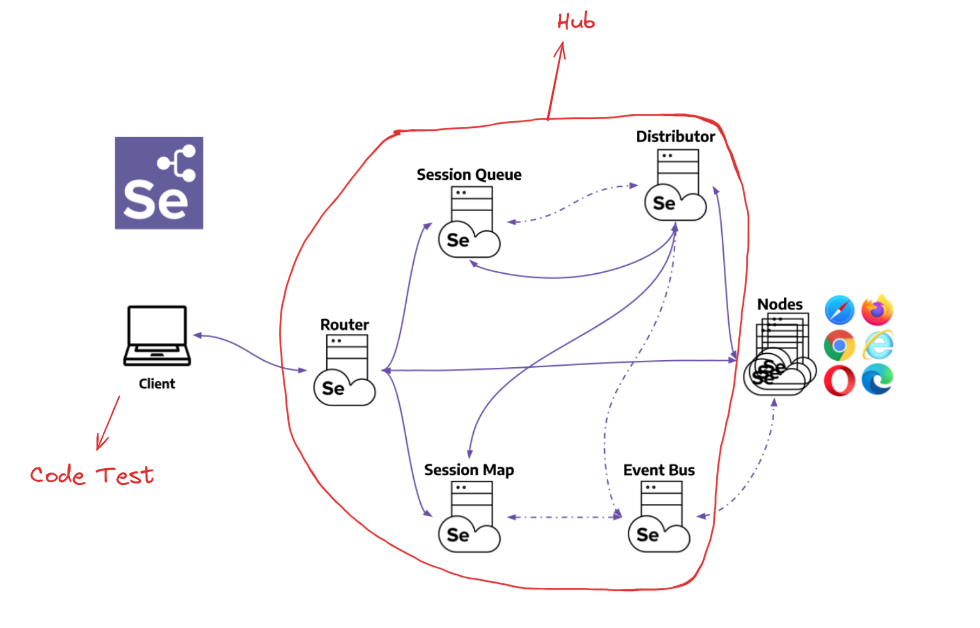
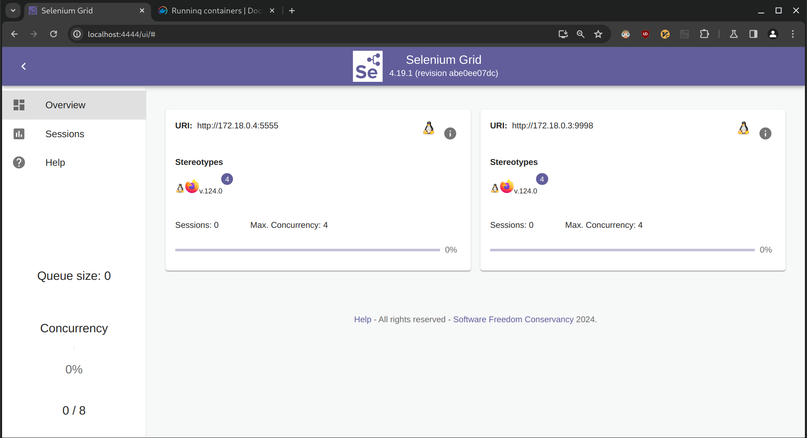
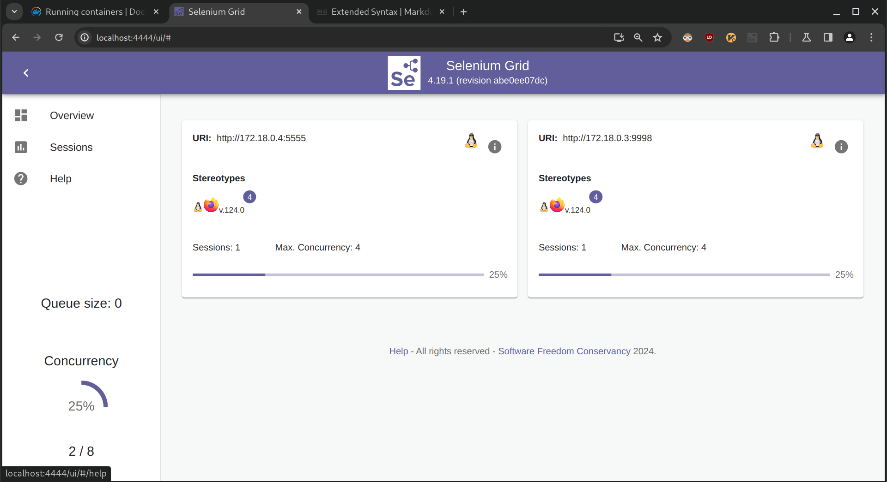
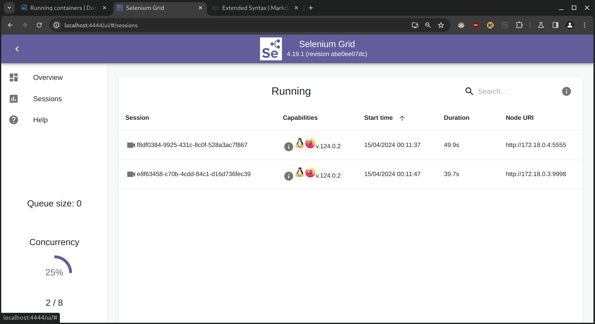

# Selenium grid: Hub và Node
## Kiến trúc mô hình



- Client : Client là các file code test. Trên file code test này có chứa đoạn code để trỏ tới địa chỉ ip và port của hub. Khi chạy test, request sẽ được đưa đến hub.

- Hub : Hub là trung tâm để xử lý và điều hướng các request từ client gửi đến, nó chứa các compenents: Router, Session Queue, Distributor, ...  Các request này tùy vào đoạn code client đã config dùng trình duyệt gì, version nào mà Hub sẽ đưa request đó tới Node phù hợp.

- Node : Node là môi trường chứa trình duyệt mà đoạn code client sẽ được thực thi. Mỗi Node có thể là một máy tính hoặc container Docker có hệ điều hành và trình duyệt khác node khác.

-> Mục đích của việc dùng Node và Hub của Selenium Grid:  Giúp chạy song song bộ test suit trên nhiều trình duyệt, nhiều version, nhiều hệ điều hành khác nhau. Cơ chế của Node và Hub giúp tối ưu hóa thời gian chạy bộ test. 

Link tài liệu: https://www.selenium.dev/documentation/grid/getting_started/

## Cài đặt: 

### Cài các file docker:
Hub: https://hub.docker.com/r/selenium/hub
``` 
docker pull selenium/hub
```

Node Firefox: https://hub.docker.com/r/selenium/node-firefox
``` 
docker pull selenium/node-firefox
```
Các Node trình duyệt khác như Edge, Chrome, ... ở trên https://hub.docker.com/u/selenium

## Chạy:

- Cách chạy dưới phần "how to run this image": https://hub.docker.com/r/selenium/hub

1. Tạo docker network
```
docker network create grid
```

2. Start Hub
```
docker run -d -p 4442-4444:4442-4444 --net grid --name selenium-hub selenium/hub:latest
```

3. Start Node
```
docker run -d  -p 7900:7900  --net grid  -e SE_EVENT_BUS_HOST=selenium-hub     --shm-size="2g" -e SE_NODE_PORT=9998    -e SE_EVENT_BUS_PUBLISH_PORT=4442     -e SE_EVENT_BUS_SUBSCRIBE_PORT=4443 -e SE_NODE_MAX_SESSIONS=4 -e SE_NODE_OVERRIDE_MAX_SESSIONS=true     selenium/node-firefox:latest
```

- Để xem live preview VNC của Node , Expose port ```-p 7900:7900``` (port trước ':' là port expose ra máy tính, port sau ':' là port của VNC trong Node),Truy cập đến  http://localhost:7900/  để xem VNC của Node, nếu dùng nhiều Node trên một máy tính thì chỉnh port trước ví dụ ```-p 7800:7900``` 
- Mặc định Max Sessions của Node là 1 , để tăng Max Sessions chỉnh số lượng param ```SE_NODE_MAX_SESSIONS``` và chỉnh param ```SE_NODE_OVERRIDE_MAX_SESSIONS``` là ```true```
- Các param về Node có thể đọc thêm ở đây: https://github.com/SeleniumHQ/docker-selenium/blob/trunk/README.md#node-configuration-options

# Kết quả

- Chạy Hub và chạy 2 Node Firefox 2 tham số ```-p 7900:7900``` và ```-p 7800:7900``` , khi đến http://localhost:4444/ ra giao diện: 



- Trong đoạn code setup đoạn sau để webdriver trỏ đến địa chỉ ip và port của hub:
```c#
var gridUrl = new Uri("http://localhost:4444/wd/hub");
_webDriver = new RemoteWebDriver(gridUrl, new FirefoxOptions());
```

- Khi Run Test thì Hub sẽ tạo 1 session tương ứng với 1 Test, giả sử chạy 2 Test thì trên giao diện Hub được:



- Click vào tab Sessions trên giao diện được:



Có thể click vào icon video và nhập mật khẩu là ```secret``` trên mỗi session để xem quá trình thực thi test trên trình duyệt.
