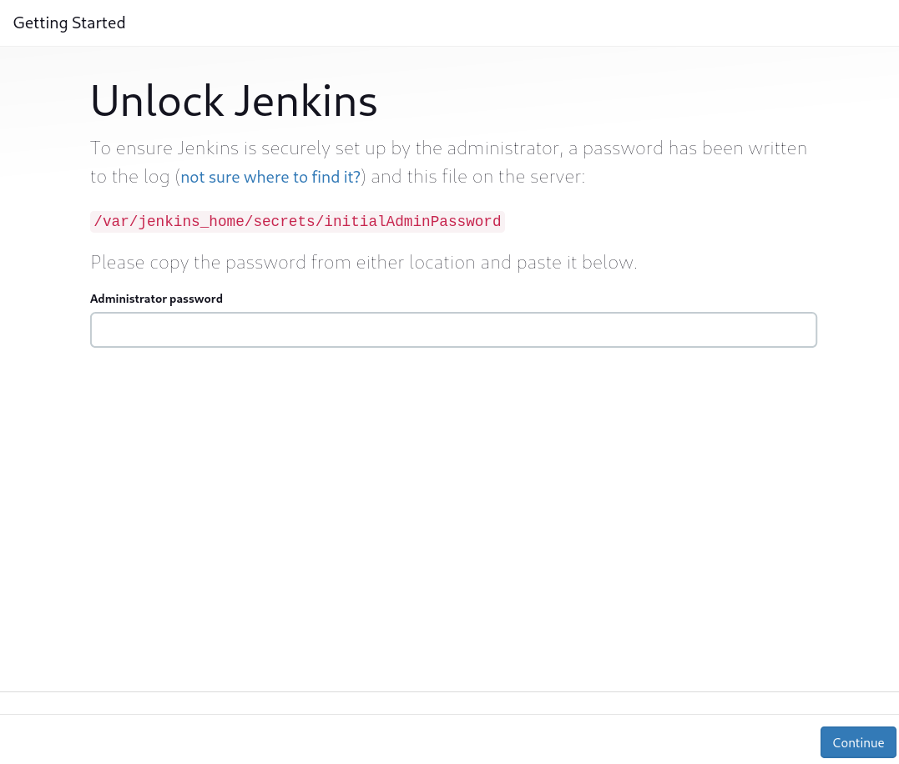
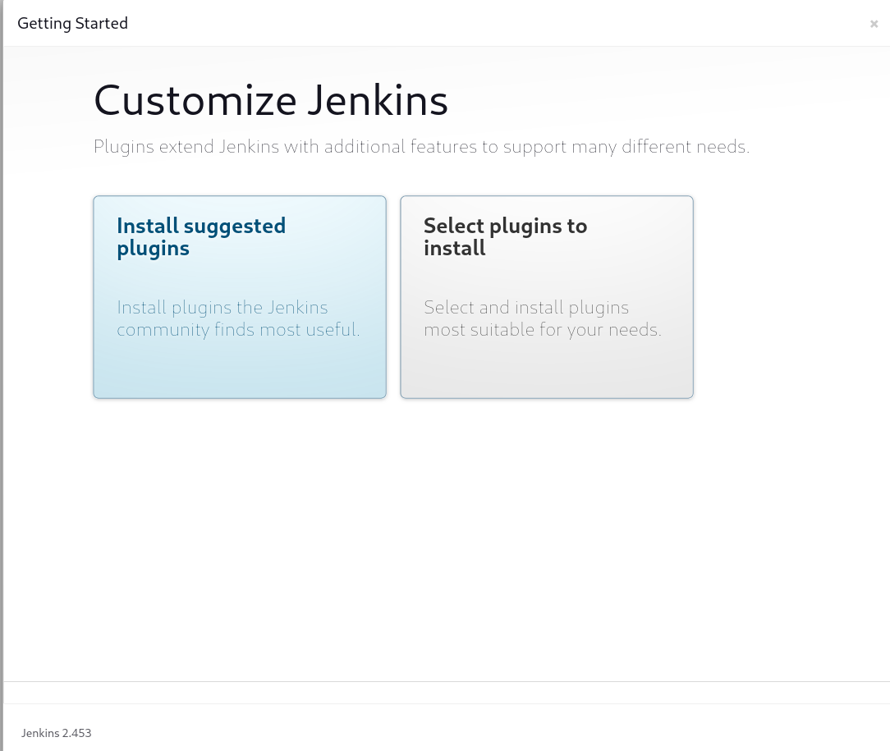
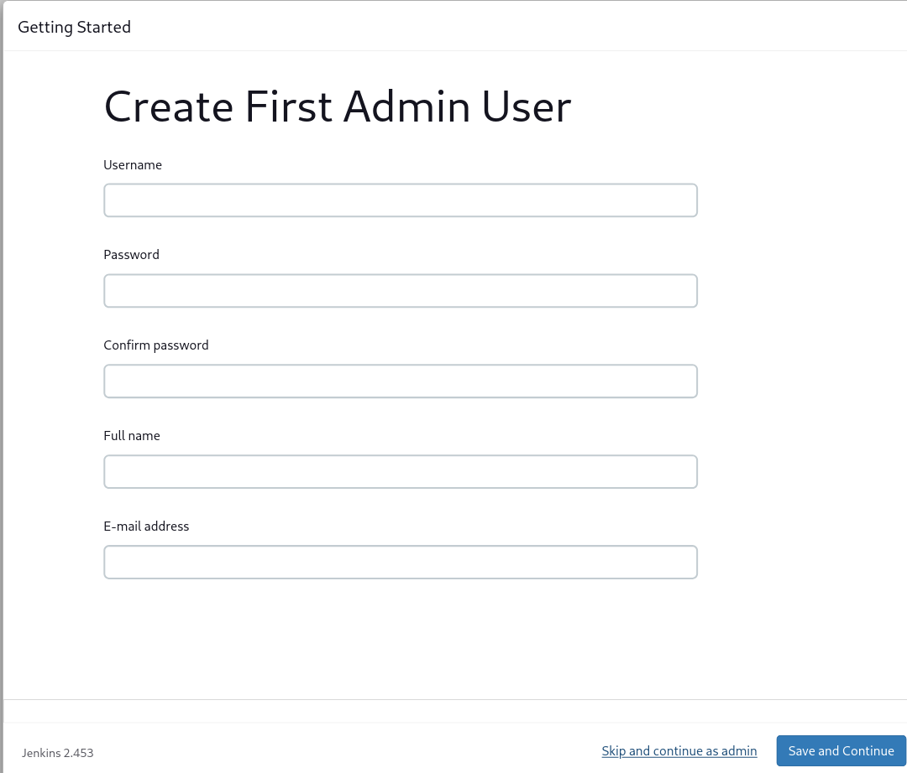
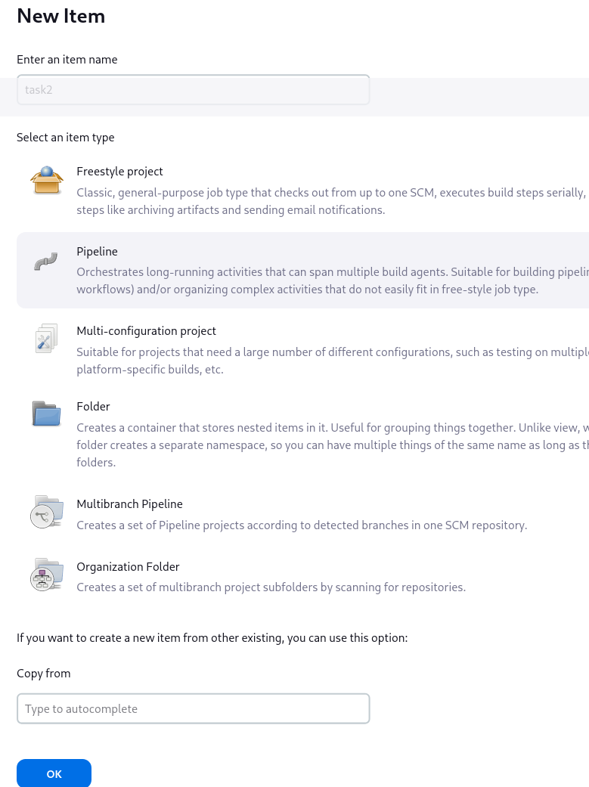

Folder structure
------------

- ***jenkins_dotnet***: Jenkins service with dotnet and allure installed
- ***nginx***: Nginx service
- ***report_site***: folder contains all test result which generated by allure report and used by nginx

Installation
------------
Use docker compose to start jenkins and nginx services
```sh
docker-compose up -d
```
After services are up, acess to **http:localhost:8080** to go to jenkins website

Setup
----
1. Acess to **http:localhost:8080**

2. Access to jenkins container and get the password using this command
```sh
docker exec -it <jenkins container> bash
cat /var/jenkins_home/secrets/initialAdminPassword
```
3. Enter the password and Press continue. Then choose **install suggested plugins**

4. When plugins are installed, you will need to create new administrator account and press **Save and Continue**

5. After everything are done. You will navigate to jenkins main page.

Create Job
------------
### Create pipeline job
1. Click New Item
2. Enter Job name and choose pipeline 


3. Enter the scripts 
```groovy
pipeline {
   agent any

   stages {
      stage('Checkout') {
         steps {
            git branch: 'main', changelog: false, poll: false, url: 'https://github.com/KanadeSup/specflow-demo'
         }
      }
      stage('Test') {
         steps {
            catchError(buildResult: 'SUCCESS', stageResult: 'FAILURE') {
               sh "dotnet test --filter TestCategory=Task1"
            }
         }
      }
      stage('Report') {
         steps {
            sh 'allure generate -c -o /var/jenkins_home/allure/${PWD##*/}'
         }
      }
   }
}
```

View Report
------------
To view report a specific job, we need access to this url:
```
http://localhost:8888/<job name>/
```
